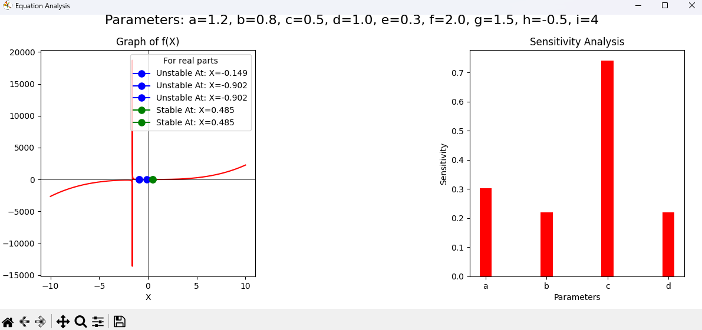

# Non-Linear Equation Solver, Senstivity, Stability and Variance Analysis.

## Overview
This Python project solves a **non-linear equation** and analyzes the stability of its roots. Additionally, it performs **sensitivity analysis** to understand how different parameters affect the function.

## Features
- **Solves a non-linear equation** for given parameters.
- **Performs stability analysis** using the derivative of the function.
- **Plots the function f(Φ)** and highlights equilibrium points.
- **Conducts sensitivity analysis** to determine the impact of parameters on function behavior.

## Requirements
Make sure you have the following dependencies installed before running the script:

```bash
pip install numpy matplotlib sympy
```

## Usage
Run the Python script using:

```bash
python script.py
```

The program will prompt you to enter values for the parameters:
- **κ (kappa)**
- **m**
- **ρ (rho)**
- **σ (sigma)**
- **C**

After entering the values, it will:
1. Display the constructed equation.
2. Solve for equilibrium points (roots of f(Φ)).
3. Analyze the stability of the roots using the function's derivative.
4. Plot the function along with equilibrium points.
5. Perform sensitivity analysis and generate a bar graph.

## Output
The script generates:
- A **graph of f(Φ)** with equilibrium points marked.
- A **bar chart for sensitivity analysis**.
- Printed **roots and their stability** in the console.



## Example Equation
If the parameters are:

$$\kappa = 1.2, m = 0.8, \rho = 0.5, \sigma = 0.3, C = 2.0$$

Then the equation solved is:

$$
\frac{\kappa^2}{2 (m^2 + \rho \kappa)} \Phi^3 +
\frac{3 \sigma \kappa}{2 (m^2 + \rho \kappa)} \Phi^2 +
\frac{\sigma^2}{2 (m^2 + \rho \kappa)} \Phi +
\frac{C \kappa}{2 (m^2 + \rho \kappa)} = 0
$$

The script will solve for Φ and determine stability.

## Contribution
Feel free to contribute by opening an issue or submitting a pull request!

## License
This project is open-source and licensed under the MIT License.
